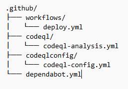

# codeql
CodeQL is the code analysis engine developed by __GitHub__ to automate security checks. You can analyze your code using CodeQL and display the results as code scanning alerts.
CodeQL treats code like data, allowing you to find potential vulnerabilities in your code with greater confidence than traditional static analyzers.

You generate a __CodeQL__ database to represent your codebase.
Then you run CodeQL queries on that database to identify problems in the codebase.
The query results are shown as code scanning alerts in GitHub when you use CodeQL with code scanning.

Learn more 👉 https://docs.github.com/es/code-security/codeql-cli/using-the-advanced-functionality-of-the-codeql-cli/publishing-and-using-codeql-packs

This structure is quite common for __projects__ that use __GitHub Actions__, __CodeQL__, and __Dependabot__. You can adjust the names and contents according to your specific needs.

